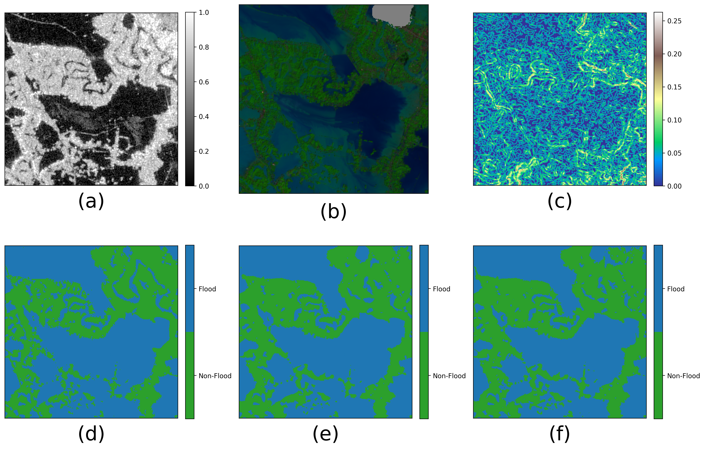

### 4.3.2 Evaluasi Akhir Model pada Data Uji Aceh Utara

Setelah konfigurasi hyperparameter terbaik diperoleh melalui skema *spatial cross-validation*, model U-Net dan ProCANet dilatih ulang menggunakan seluruh wilayah *cross-validation* dan kemudian dievaluasi pada wilayah uji independen Aceh Utara. Wilayah ini tidak digunakan pada proses pelatihan maupun validasi sehingga hasil evaluasi pada subbab ini merepresentasikan kemampuan generalisasi spasial model terhadap wilayah baru. Data uji Aceh Utara terdiri atas 493 tile, yaitu 332 tile positif yang mengandung piksel banjir dan 161 tile latar belakang, dengan total 22.122.708 piksel banjir pada area label valid.

Evaluasi dilakukan terhadap piksel yang berada pada area valid, yaitu irisan antara `label_valid_mask` dan `feature_valid_mask`. Dengan demikian, piksel di luar cakupan analisis UNOSAT atau piksel yang tidak memiliki fitur masukan valid tidak dihitung sebagai benar maupun salah. Ambang klasifikasi probabilitas yang digunakan adalah 0,5, sedangkan label air/sungai permanen (`water_river_mask`) tidak digabungkan sebagai kelas banjir pada evaluasi akhir. Ringkasan metrik evaluasi akhir ditampilkan pada Tabel 4.2.

##### Tabel 4.2 Evaluasi Akhir U-Net dan ProCANet pada Data Uji Aceh Utara

| Model | Loss | IoU | Dice/F1 | Akurasi | Precision | Recall | Specificity |
|---|---:|---:|---:|---:|---:|---:|---:|
| U-Net | 0,6050 | 0,8510 | 0,9195 | 0,9707 | 0,9322 | 0,9072 | 0,9851 |
| ProCANet | 0,6285 | 0,8383 | 0,9120 | 0,9688 | 0,9473 | 0,8793 | 0,9890 |

Berdasarkan Tabel 4.2, U-Net menghasilkan performa keseluruhan terbaik pada data uji Aceh Utara. Nilai IoU U-Net mencapai 0,8510, lebih tinggi 0,0127 poin dibandingkan ProCANet yang memperoleh IoU 0,8383. Pola serupa terlihat pada Dice/F1, yaitu 0,9195 pada U-Net dan 0,9120 pada ProCANet. Akurasi kedua model sama-sama tinggi karena sebagian besar area valid merupakan latar belakang non-banjir, tetapi U-Net tetap memiliki akurasi lebih tinggi, yaitu 0,9707 dibandingkan 0,9688.

Perbedaan kedua model menjadi lebih jelas ketika dilihat melalui komponen *confusion matrix* piksel pada Tabel 4.3. U-Net menghasilkan jumlah *true positive* lebih besar, sedangkan ProCANet menghasilkan jumlah *false positive* lebih kecil. Hal ini menunjukkan bahwa U-Net lebih sensitif dalam menangkap area banjir, sementara ProCANet lebih konservatif dalam menetapkan piksel sebagai banjir.

##### Tabel 4.3 Komponen Confusion Matrix Piksel pada Data Uji Aceh Utara

| Model | True Positive | True Negative | False Positive | False Negative |
|---|---:|---:|---:|---:|
| U-Net | 16.863.330 | 81.075.762 | 1.227.212 | 1.725.554 |
| ProCANet | 16.344.540 | 81.394.556 | 908.418 | 2.244.344 |

Tabel 4.3 memperlihatkan bahwa ProCANet menurunkan jumlah *false positive* sebesar 318.794 piksel atau sekitar 25,98% dibandingkan U-Net. Penurunan ini konsisten dengan nilai precision ProCANet yang lebih tinggi, yaitu 0,9473 dibandingkan 0,9322 pada U-Net. Dengan kata lain, ketika ProCANet memprediksi suatu piksel sebagai banjir, prediksi tersebut cenderung lebih bersih dari kesalahan komisi pada area non-banjir.

Namun, peningkatan precision tersebut diikuti oleh kenaikan *false negative* sebesar 518.790 piksel atau sekitar 30,07%. Recall ProCANet turun menjadi 0,8793, sedangkan U-Net mencapai 0,9072. Dalam konteks pemetaan banjir, penurunan recall ini penting karena *false negative* berarti area terdampak banjir tidak terdeteksi oleh model. Oleh sebab itu, meskipun ProCANet lebih baik dalam mengurangi prediksi banjir berlebih, U-Net lebih unggul untuk tujuan deteksi cakupan banjir yang mengutamakan kelengkapan area terdampak.

##### Gambar 4.5 Perbandingan Metrik Evaluasi Akhir U-Net dan ProCANet pada Data Uji Aceh Utara

Secara visual, hasil evaluasi pada Gambar 4.5 memperkuat temuan numerik pada Tabel 4.2. U-Net memiliki keunggulan pada metrik yang mengukur tumpang tindih area banjir, yaitu IoU dan Dice/F1. Sebaliknya, ProCANet menunjukkan keunggulan pada precision dan specificity. Pola ini menandakan adanya perbedaan karakter keputusan kedua arsitektur. U-Net cenderung menghasilkan prediksi yang lebih luas sehingga lebih banyak area banjir berhasil ditangkap, tetapi sebagian area non-banjir ikut terklasifikasi sebagai banjir. ProCANet lebih selektif, sehingga kesalahan pada area non-banjir berkurang, tetapi sebagian piksel banjir tidak ikut terdeteksi.

Temuan tersebut sejalan dengan karakteristik model segmentasi banjir berbasis fusi multi-sensor. Informasi Sentinel-1 berperan kuat karena sinyal SAR tetap tersedia pada kondisi berawan dan hujan, sedangkan fitur Sentinel-2 dan DEMNAS membantu memberikan konteks spektral serta topografi. Pada ProCANet, pemisahan cabang masukan untuk kanal SAR berpotensi membuat model lebih berhati-hati dalam membedakan banjir dari badan air atau permukaan gelap lain. Akan tetapi, pada data uji Aceh Utara, strategi tersebut belum menghasilkan IoU lebih tinggi dibandingkan U-Net. Salah satu kemungkinan penyebabnya adalah karakter banjir di Aceh Utara memiliki area genangan luas sehingga arsitektur U-Net yang langsung memadukan tujuh kanal masukan mampu membentuk batas area banjir yang lebih lengkap.

Jika dikaitkan dengan pembahasan pustaka, hasil ini mendukung prinsip umum bahwa fusi SAR, data optis, dan informasi topografi dapat meningkatkan kemampuan segmentasi banjir dibandingkan penggunaan satu sumber data saja. Feliren dkk. memperkenalkan ProCANet sebagai model *progressive cross-attention* untuk segmentasi banjir multispektral dan melaporkan IoU tertinggi 0,815 pada dataset Sen1Floods11 dan data banjir DAS Citarum. Pada penelitian ini, ProCANet juga menunjukkan kemampuan yang kuat dengan IoU 0,8383 pada Aceh Utara, tetapi masih berada di bawah U-Net yang mencapai IoU 0,8510. Perbandingan ini tidak dapat dibaca sebagai perbandingan langsung karena dataset, wilayah kajian, label rujukan, dan komposisi kanal masukan berbeda. Akan tetapi, temuan ini menunjukkan bahwa arsitektur yang lebih kompleks tidak otomatis menghasilkan performa terbaik pada seluruh metrik. Keunggulan ProCANet lebih tampak pada pengendalian *false positive*, sedangkan U-Net lebih baik dalam mempertahankan *recall* dan tumpang tindih spasial. Oleh karena itu, pemilihan model perlu disesuaikan dengan tujuan operasional: U-Net lebih sesuai ketika prioritasnya adalah memetakan area terdampak seluas mungkin, sedangkan ProCANet dapat dipertimbangkan ketika kesalahan komisi pada area non-banjir harus ditekan.

Keterbatasan evaluasi ini adalah wilayah uji akhir hanya terdiri atas satu wilayah holdout, yaitu Aceh Utara. Walaupun pemisahan berbasis wilayah sudah mengurangi risiko *spatial data leakage*, kesimpulan performa akhir tetap perlu dibaca sebagai generalisasi terhadap wilayah uji tersebut, bukan terhadap seluruh kondisi banjir di Indonesia. Selain itu, label rujukan berasal dari produk UNOSAT sehingga kualitas batas banjir mengikuti resolusi, waktu akuisisi, dan ketelitian interpretasi sumber tersebut. Dengan mempertimbangkan batasan tersebut, hasil akhir penelitian ini menunjukkan bahwa model U-Net memberikan performa segmentasi banjir terbaik secara keseluruhan pada data uji Aceh Utara, sementara ProCANet memberikan kontribusi penting dalam menekan *false positive*.
